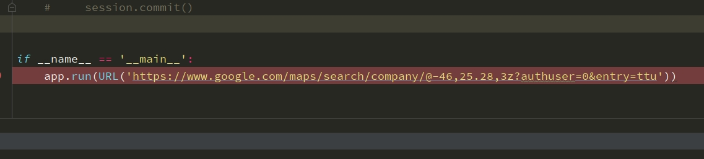
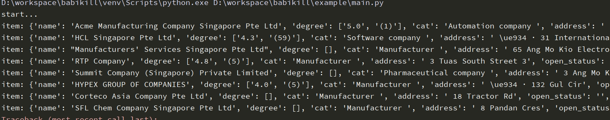

# 分布式爬虫框架 

### 一 目的 

实现一个有关google地图信息的分布式爬虫框架

### 二 功能 

- [x]  爬取google地图信息
- [x] 分布式

### 三 设计思想  

```


                                task                              
         redis/rabbitMQ/kaffa/  ===>    application.queue  ===>  handler(app, task)
                                     返回结果过滤后重新放进队列  <==    得到结果


```


### 四 使用的技术栈  

- python 3
- asyncio
- playwright
- SQLAlchemy 

### 五 开发有关  

- 克隆代码 

  ```
  git clone ....
  ```

- 目录 

  ```
  -----babikill 
    |------biubiu      #框架主要代码 
    |    |——application.py 
    |    
    |------example     #例子代码   
  ```

  

- 创建虚拟环境 

- 安装依赖库 

  ```
  cd babikill
  pip install -r requirements.txt 
  
  # 安装依赖库后，需要安装 playwright相关浏览器，参考https://playwright.dev/python/docs/intro
  playwright install
  
  ```

  

- 运行例子 

  ```
  cd babikill/example
  python main.py
  ```

  


### 六 效果图  






